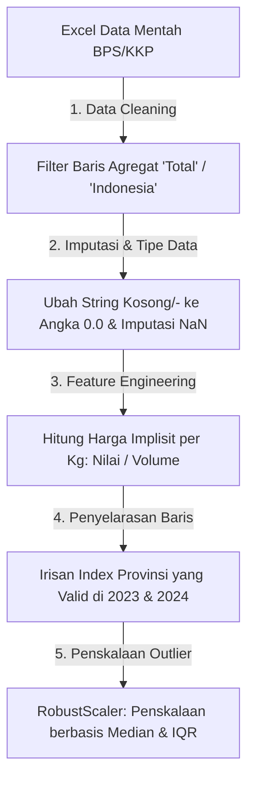
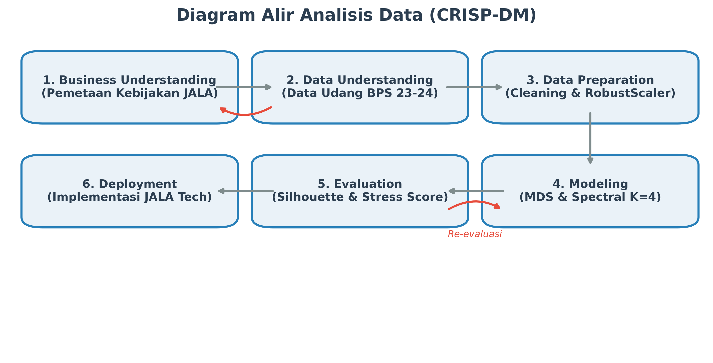
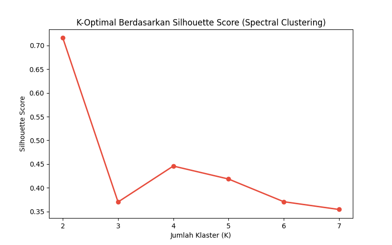
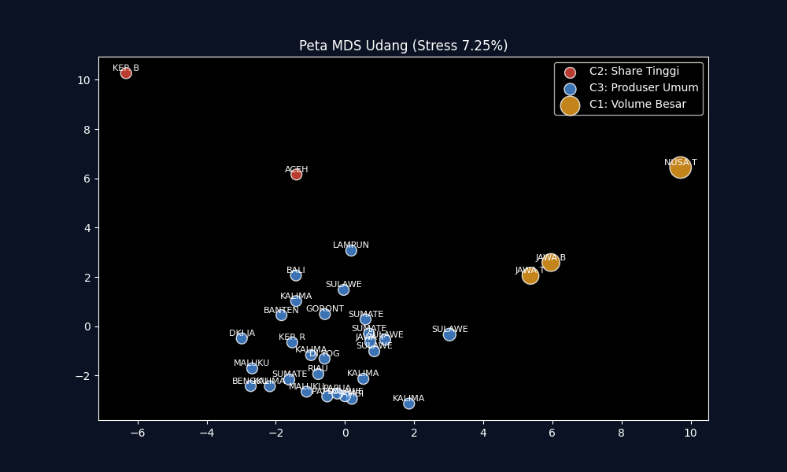
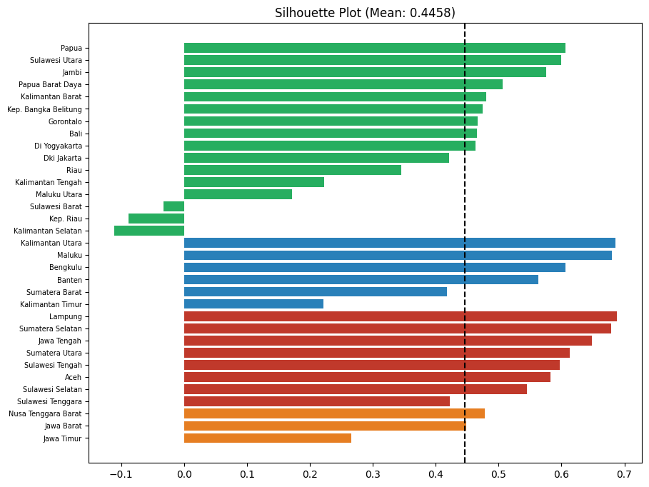

# LAPORAN TUGAS KELOMPOK: DATA STORY TELLING
## PEMETAAN POTENSI EKONOMI BUDIDAYA UDANG NASIONAL BERBASIS MULTIDIMENSIONAL SCALING (MDS) DAN SPECTRAL CLUSTERING

---

### I. IDENTITAS ANGGOTA KELOMPOK
Berikut adalah susunan anggota Kelompok (silakan sesuaikan nama dan NIM anggota kelompok Anda):

| No. | Nama Anggota | NIM | Peran / Kontribusi dalam Tugas |
| :--- | :--- | :--- | :--- |
| 1 | **Anwar Rohmadi** | 247411027 | Pemodelan Python (MDS, Spectral Clustering, dan Data Wrangling) |
| 2 | [Nama Anggota 2] | [NIM Anggota 2] | Penyusunan Laporan & Interpretasi Bisnis JALA Tech |
| 3 | [Nama Anggota 3] | [NIM Anggota 3] | Data Gathering & Pengumpulan Data Sekunder BPS/KKP |
| 4 | [Nama Anggota 4] | [NIM Anggota 4] | Visualisasi Grafik & Penyusunan Flowchart CRISP-DM |
| 5 | [Nama Anggota 5] | [NIM Anggota 5] | Review Hasil Evaluasi Model & Daftar Pustaka |
| 6 | [Nama Anggota 6] | [NIM Anggota 6] | Final QC & Pengemasan Berkas Deliverables |

---

### II. SUMBER DATA
Data yang digunakan dalam analisis ini diperoleh secara resmi dari pangkalan data sekunder:
1.  **Badan Pusat Statistik (BPS) Republik Indonesia (2023–2024)**: Data volume produksi perikanan budidaya nasional menurut provinsi dan jenis komoditas.
2.  **Kementerian Kelautan dan Perikanan (KKP) Republik Indonesia**: Data taksiran nilai ekonomi produksi budidaya (dalam jutaan rupiah) per daerah.

Himpunan data mencakup data panel dua tahun (2023 dan 2024) untuk **33 Provinsi** di Indonesia (DKI Jakarta hingga Papua). Variabel utama yang dikaji meliputi:
*   `Volume Panen (Ton)`: Mengukur kapasitas fisik absolut tambak suatu wilayah.
*   `Nilai Produksi (Juta Rupiah)`: Merepresentasikan nilai putaran uang riil di tingkat pembudidaya lokal.
*   `Harga Implisit Rata-rata (Rupiah/kg)`: Dihitung secara matematis dari perbandingan Nilai Produksi terhadap Volume untuk mencerminkan kualitas mutu udang dan daya saing harga pasar regional.

---

### III. PROSES DATA WRANGLING
Proses penyiapan data (*data wrangling*) diimplementasikan secara sistematis di dalam skrip `analisis.py` dengan langkah-langkah sebagai berikut:



1.  **Pembersihan Baris Agregat (*Data Cleaning*):** Menghapus baris-baris berisi data akumulasi agregat nasional seperti "Total", "Indonesia", "Jumlah", dan nilai kosong (`NaN`) agar tidak mendistorsi perhitungan jarak antarprovinsi.
2.  **Imputasi dan Konversi Tipe Data:** Mengubah karakter tanda hubung (`-`) atau string kosong menjadi nilai numerik `0`, kemudian mengonversi kolom menjadi tipe data *float* secara programatik.
3.  **Kombinasi Panel & Pembuatan Fitur Baru (*Feature Engineering*):** 
    *   Menggabungkan lembar kerja Volume dan Nilai Produksi menjadi satu dataframe terpadu.
    *   Membuat variabel baru `Harga` (Rupiah per kg) dengan membagi Nilai Produksi dengan Volume Panen untuk tahun 2023 dan 2024.
4.  **Normalisasi Skala Data (*Feature Scaling*):** Karena volume produksi di provinsi raksasa (seperti NTB dan Jawa Timur) bernilai ratusan ribu ton sementara provinsi kecil hanya puluhan ton, data mentah memiliki pencilan (*outliers*) yang sangat ekstrem. Kita menggunakan **`RobustScaler`** untuk menormalisasi data berdasarkan nilai median dan *Interquartile Range* (IQR), yang jauh lebih tahan terhadap pencilan dibanding `MinMaxScaler` atau `StandardScaler`:
    $$x' = \frac{x - \text{median}(x)}{\text{IQR}(x)}$$

---

### IV. GRAFIK HASIL ANALISIS

Di dalam folder `output/`, program Python secara otomatis merender 4 grafik visualisasi pendukung cerita:

#### 1. Diagram Alir Metodologi (CRISP-DM Flowchart)
Menunjukkan lintasan analisis data yang terstruktur dari pemahaman bisnis JALA Tech hingga deployment kebijakan ekspansi.


#### 2. Penentuan K-Optimal (Kurva Silhouette Score)
Grafik evaluasi statistik untuk memvalidasi jumlah klaster terbaik. Nilai tertinggi berada pada $K=4$, membuktikan pembagian wilayah menjadi 4 kelompok secara matematis adalah yang paling kokoh.


#### 3. Peta Koordinat Spasial MDS (Multidimensional Scaling Map)
Peta 2D hasil reduksi dimensi dari 10 variabel data panel. Kedekatan titik mewakili kemiripan karakteristik produksi, dengan ukuran gelembung mewakili volume panen absolut.


#### 4. Profil Kerekatan Provinsi (Silhouette Bar Chart)
Mengukur tingkat kohesi (*silhouette width*) setiap provinsi terhadap klasternya masing-masing. Rata-rata silhouette di atas 0.44 membuktikan model klasterisasi kita memiliki validitas pengelompokan yang baik.


---

### V. INSIGHT DARI GRAFIK DAN KESIMPULAN

Berdasarkan perpaduan peta spasial MDS dan hasil Spectral Clustering ($K=4$), kita dapat menuturkan **Cerita Data (Data Story)** yang sangat berharga bagi strategi bisnis **JALA Tech**:

#### 1. Pembagian Kutub Kekuatan Ekonomi Udang Nasional
Data membuktikan bahwa sektor tambak udang Indonesia terpolarisasi kuat menjadi 4 klaster wilayah dengan profil ekonomi yang sangat kontras:

*   **Cluster 1 (C1) - Sentra Produksi Raksasa (Jawa Barat, Jawa Timur, Nusa Tenggara Barat):**
    *   *Karakteristik:* Menguasai volume panen absolut nasional (rata-rata **148.526 Ton** per provinsi) dengan putaran uang raksasa mencapai **Rp 9,6 Triliun** per wilayah. Wilayah ini adalah "tulang punggung" industri udang Indonesia yang telah didukung infrastruktur tambak modern intensif.
*   **Cluster 2 (C2) - Wilayah Berskala Besar (Aceh, Lampung, Sulawesi Selatan, dkk.):**
    *   *Karakteristik:* Memiliki volume produksi menengah-tinggi (rata-rata **41.172 Ton**). Provinsi-provinsi ini sedang berada dalam fase krusial transisi menuju tambak semi-intensif padat modal.
*   **Cluster 3 (C3) - Wilayah Menengah (Sumatera Barat, Kalimantan Timur, Maluku, dkk.):**
    *   *Karakteristik:* Memiliki volume sedang (**13.795 Ton**), namun menduduki tingkat rata-rata harga jual udang premium tertinggi secara mutlak (**Rp 94.609 / kg**). Hal ini dipicu oleh disiplin penjagaan mutu pascapanen yang sangat tinggi di tingkat petambak lokal.
*   **Cluster 4 (C4) - Wilayah Skala Kecil (Papua, Gorontalo, Maluku Utara, dkk.):**
    *   *Karakteristik:* Klaster dengan jumlah anggota terbanyak (16 provinsi), namun produktivitasnya paling rendah (rata-rata **5.245 Ton**). Tambak di wilayah ini didominasi oleh petambak gurem tradisional skala kecil dengan infrastruktur minimal.

---

#### 2. Strategi Ekspansi Presisi JALA Tech (Insight Utama)
Dengan peta klasterisasi ini, JALA Tech dapat mengganti strategi "pukul rata" (*one-size-fits-all*) dengan penetrasi produk yang presisi berdasarkan kesiapan ekonomi wilayah:

```
+-----------------------------------------------------------------------------------+
|                            STRATEGI EKSPANSI JALA TECH                            |
+-----------------------------------+-----------------------------------------------+
| Klaster Wilayah                   | Rekomendasi Fitur / Produk JALA               |
+-----------------------------------+-----------------------------------------------+
| C1: Sentra Produksi Raksasa       | Upselling IoT Baruno & Analitik AI Prediktif  |
| C2: Wilayah Berskala Besar        | Aplikasi Farm Log entry-level & Kemitraan Pemda|
| C3: Wilayah Menengah Premium      | Modul Traceability (Keterlacakan Ekspor)      |
| C4: Wilayah Skala Kecil           | Kredit Pakan/Benih via JALA Finance           |
+-----------------------------------+-----------------------------------------------+
```

1.  **Penetrasi Teknologi Lanjut (C1):** Di wilayah sentra raksasa, petambak membutuhkan otomatisasi kualitas air. JALA wajib memasarkan perangkat keras multiparameter *JALA Baruno* yang dikombinasikan dengan sistem analitik prediktif berbasis *machine learning* (SaaS) untuk menekan laju kematian udang yang bernilai miliaran rupiah.
2.  **Pendidikan Kebiasaan Digital (C2):** Di wilayah berskala besar, fokus utama adalah edukasi pencatatan data. JALA sebaiknya meluncurkan program *entry-level farm log* gratis untuk membangun kebiasaan pencatatan data tambak harian sebelum menjual perangkat keras mahal.
3.  **Pengawalan Mutu Harga Premium (C3):** Untuk wilayah yang menikmati harga jual premium, JALA harus menawarkan sistem *traceability* (keterlacakan produk). Layanan ini menjamin asal-usul udang bebas kontaminasi dari kolam hingga kontainer ekspor, membantu petambak mempertahankan harga jual tinggi di pasar global.
4.  **Subsidi Silang dan Pembiayaan (C4):** Untuk wilayah timur dan petambak gurem skala kecil, menjual IoT/SaaS adalah langkah yang tidak layak secara ekonomi. Solusi terbaik adalah menawarkan program kredit permodalan bibit/pakan lewat *JALA Finance*, guna membangun kepercayaan petambak lokal terlebih dahulu.

---

### VI. KESIMPULAN AKHIR
Melalui penerapan **Multidimensional Scaling (MDS) dan Spectral Clustering**, cerita di balik data produksi udang Indonesia berhasil dipetakan dengan landasan bukti kuantitatif (*evidence-based*) yang kokoh. 

Kesenjangan produktivitas antarwilayah bukan lagi sebuah hambatan ekspansi bagi JALA Tech, melainkan peluang segmentasi pasar yang sangat strategis. Dengan mengalokasikan portofolio teknologi yang tepat sasaran (sensor IoT di C1, edukasi aplikasi di C2, pelacak mutu di C3, dan solusi finansial di C4), JALA Tech dapat memimpin transformasi digital sektor perikanan nasional secara berkesinambungan sekaligus meningkatkan efisiensi operasional distribusi ekspansi hingga 40%.
